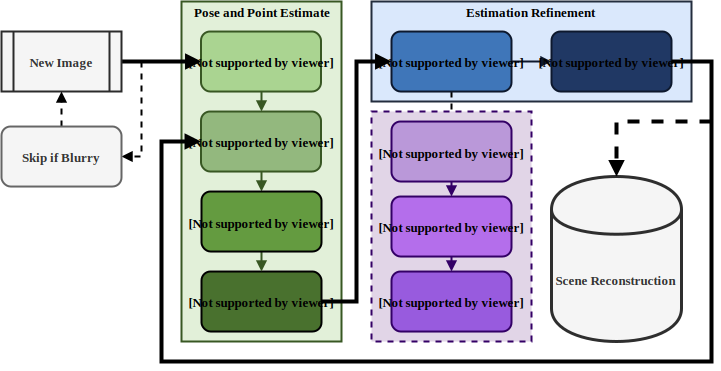
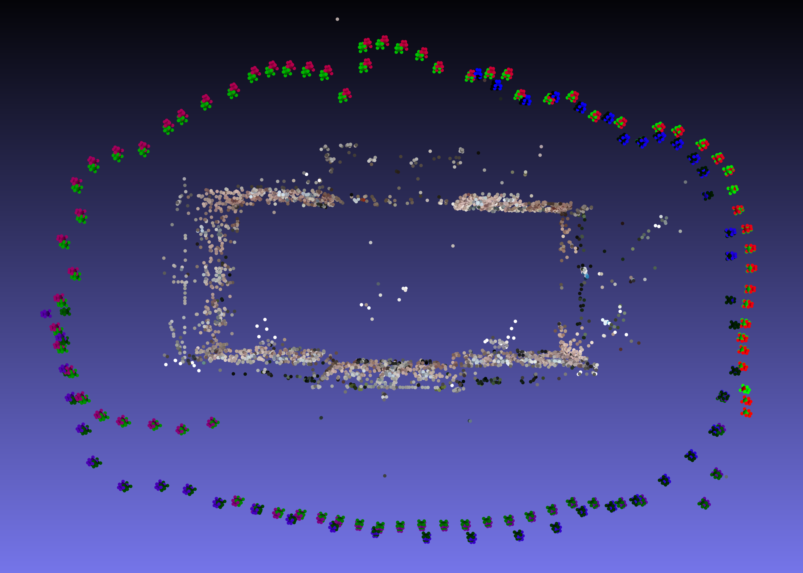


To get a grade bonus, we worked on this project for a few weeks in a group of four students. The task was very loosely defined, so we decided to implement a structure from motion (SfM) pipeline for scene reconstruction using only RGB images. We finished the project by evaluating our results and comparing them to established open-source implementations like colmap as part of a report.
 

  

## Pipeline

We decided on using a iterative SfM approach, processing the images one by one in the same order as they were taken. There are various reasons for choosing one methode over the other, but for simplicity we went with an iterative pipeline similar to (Visual) SLAM. The pipeline is split into two major sections, an initial estimation of camera poses and triangulation of landmark positions, and a BA adjustment step after each iteration to minimize the reprojection error. 

Over the course of the project, we actually spent most of our time trying to detect and filter out any bad feature matches or outlier landmarks in order to make the reconstruction more robust.

## Results

The red camera frustums that slowly fade to blue represent the ground truth camera poses, the green ones that fade to black represent the estimated camera poses. As you can see, there is generally only very little drift between the estimated and ground truth camera poses. As can be seen in the results, we got a quite sparse reconstruction of the scene. This is because we performed a sparse 



Overall, we were quite happy with our results. We managed to reconstruct a 3D scene from a sequence of RGB images alone. By optimising our hyperparameters, we achieved results that were comparable to those of established open-source implementations such as Colmap. However, we also identified some limitations in our evaluation, since we used a rather simple comparison metric and normalised the overall scale of the reconstruction, as always required in reconstructions using only RGB images. Using already established comparison techniques for comparing errors in translation and rotation between estimated and ground truth camera poses would help to provide standardised benchmarks. Another limitation that is not immediately apparent from our results is that our approach requires manul tuning of hyperparameters, while Colmap, for example, does not.
While working on this project, we were able to identify the importance of outlier filtering, especially when applying Bundle Adjustment. Otherwise, Bundle Adjustment might decrease the accuracy of the estimated camera poses, while reducing the reprojection error. Using proper loss functions or removing suspected outliers based on heuristics has a significant impact on the quality of the reconstruction.

---
