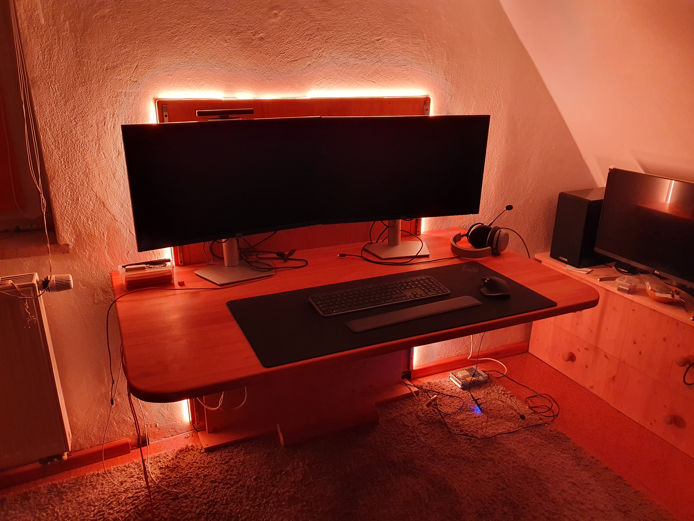
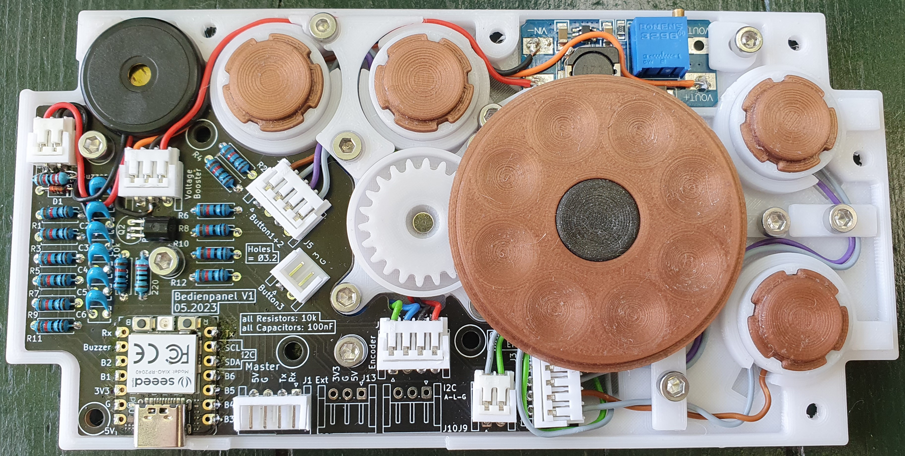
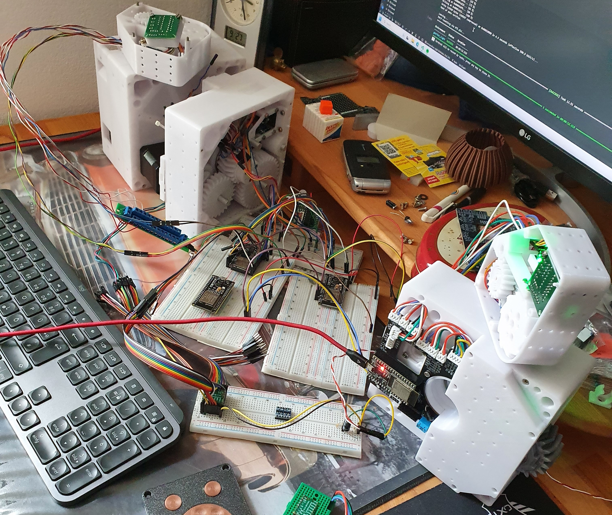


This project was initiated by my brother, a mechanical engineering student, and me. It's a custom-built, height-adjustable desk mounted to a wall. The desk offers a comfortable working position whether standing or sitting, with a wide range of height adjustments and customizable profiles. Additionally, users can control peripherals like an LED strip around the desk or a Spotify Connect client.


  

<!-- TODO: How to add .rounded CSS class? -->
<!--  -->

## Status

Due to some setbacks, the desk is not yet fully functional. The self-crafted wooden structure is mostly finished, and the software is partially done, with the most fundamental features implemented and others to be added later. However, we're still addressing issues with the electrical and mechanical components. Specifically, the motor gearing lacks the necessary torque to lift the desk. We'll replace the gearing once we have the suitable machinery.

## Structure
The desk is wall-mounted and uses two identical stepper motors for lifting. This two-motor setup requires synchronization to function properly. Additionally, the desk has two brakes on each side to ensure stability in all circumstances. Each motor and brake system is controlled by a separate ESP32 microcontroller, connected to another ESP32 that acts as the general controller. This general controller handles motor synchronization and communication with the user interface. Currently, the user interface consists of a control panel with 4 buttons and a rotary encoder, and we plan to integrate an LED matrix display into the wooden frame later.

## General Controller

The general controller is the brain of the desk, coordinating all its actions. It processes UI events from the control panel and monitors the current state of the motors and brakes to execute necessary actions and switch to the proper UI state. As the LED matrix display is not yet integrated, the UI state exists only as a virtual state machine.

## Control Panel

The control panel features 5 buttons, a piezo buzzer, and a rotary encoder, and is integrated into the underside of the desk for easy access while keeping it out of sight. The panel's menu system allows for desk movement, profile configuration, and control of peripherals like the LED strip and Spotify Connect. It connects to the general controller via UART.

The control panel listens for button presses and rotary encoder rotations, applying a hysteretic filter to prevent accidental changes. It encodes button presses into single clicks, double clicks, long presses, and double click-and-hold actions. Despite using a capacitor to debounce the buttons, the software applies an additional debounce to eliminate residual noise.

One additional feature is the piezo buzzer, which can play simple songs or sound effects.

## Motor Controller

The motor controller receives the requested desk height from the general controller and operates the stepper motor with smooth acceleration and deceleration. It also monitors the position of the other motor to ensure synchronization. The motor controller communicates with the general controller via I2C.

## LED Matrix Controller

The LED matrix will be installed near the backplate of the desk, below the monitors, and hidden behind a thin wooden plate to allow the light to shine through while keeping the matrix itself invisible. The LED matrix will display the UI, including the current profile, the song playing on Spotify, or the time.

## Some Issues

Apparently, the latest version of the gearbox has some issues with resonance frequencies.



---
