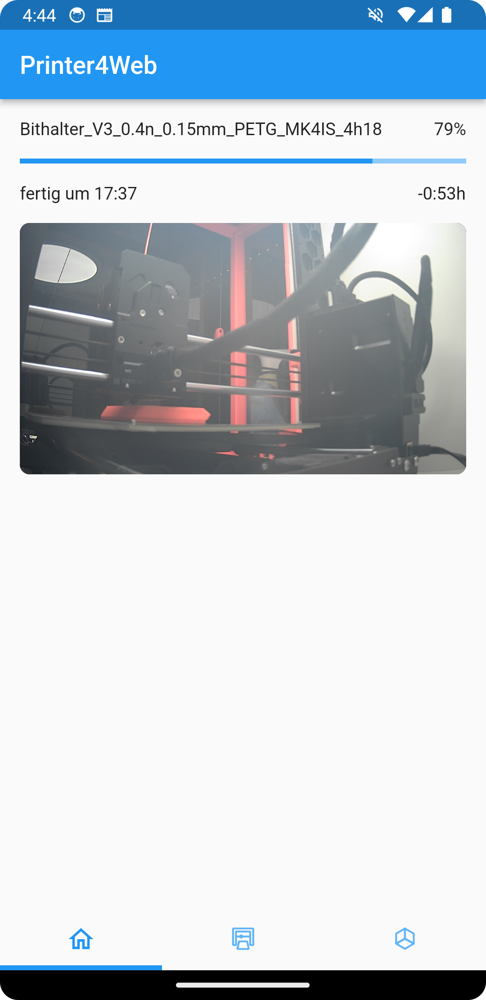
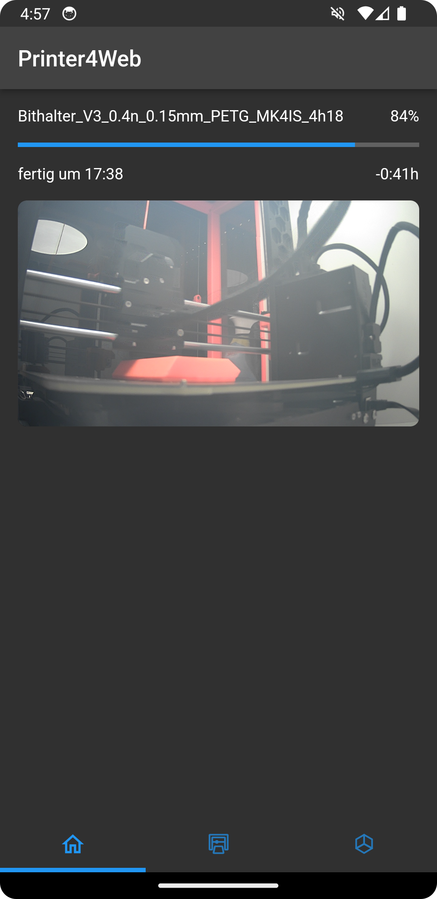
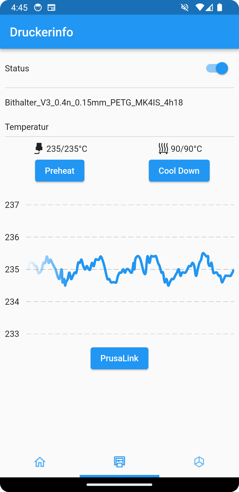
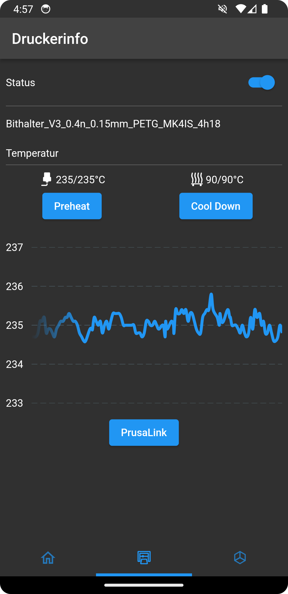
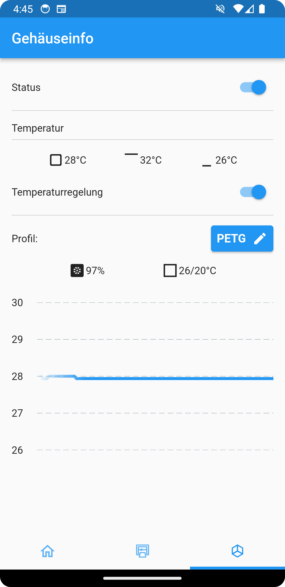
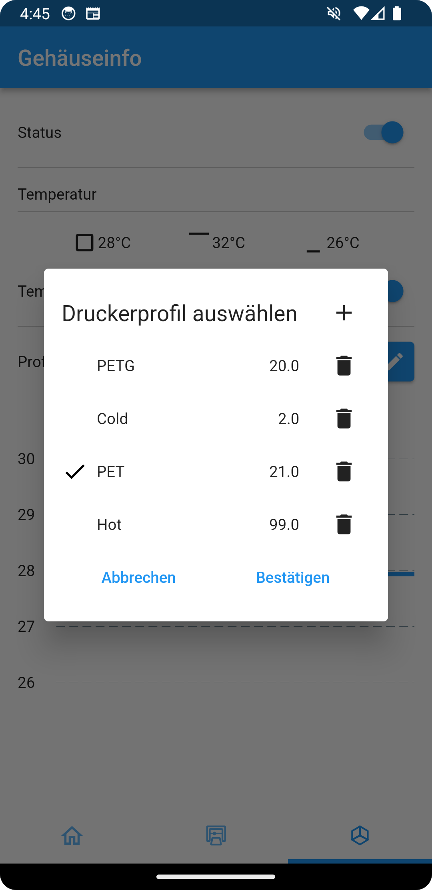


This is the flutter companion app for the [printer housing project](). This app connects to the Raspberry Pi that runs the printer service controller software, allowing you to monitor the current temperature and print progress. Additionally, it enables control over the housing temperature and the preheating of the heatbed and nozzle. Built with Flutter, this app is compatible with both Android and web platforms.


  

## Overview


## Homescreen


  
  


On the homescreen, you can track the print progress and watch a live video feed of the printer. When launched, the app connects to the Raspberry Pi, activates the light, and starts the video stream. You also get an estimate of the remaining print time.

<!-- In the first tab, you can track the print progress and watch a live video feed of the printer. When launched, the app connects to the Raspberry Pi, activates the light, and starts the video stream. It also displays two graphs showing the temperature history inside the housing and the heatbed. Additionally, you can view the current temperatures outside the housing and at the nozzle. -->

## Printer Information


  
  


On the printer information tab, you can view the temperature of the heatbed and nozzle, preheat or cool down the printer, or connect to the PrusaLink website.

## Configuration


  
  


On the configuration tab, you get an overview of the current temperature at the top and bottom of the housing, the outside temperature and the current fan speed. Additionally, you can easily adjust the target temperature by switching between predefined print profiles or creating a custom profile.

## History
As the name implies, this is actually the fourth iteration of the printer companion app. Initially, the app was developed for Android, but I transitioned to Flutter to enable web accessibility, allowing printer access from any device without installation. Over the years, changes in the printer housing, the Prusa Connect API, and evolving requirements prompted several reimplementations. These updates not only kept the app current but also provided opportunities to experiment with new technologies.

---
