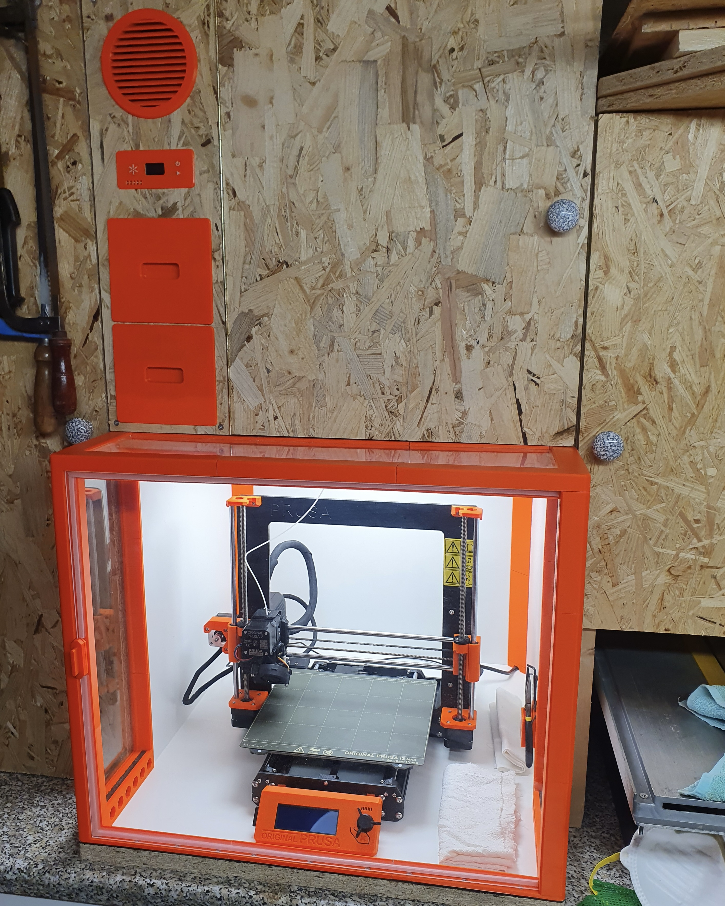
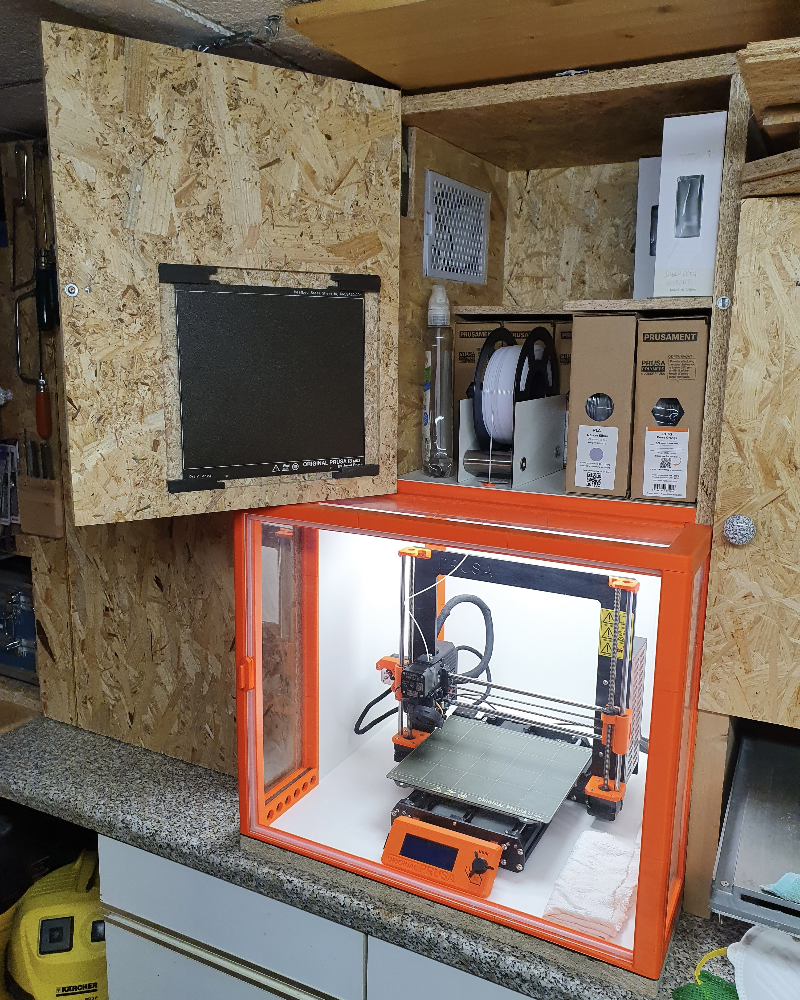
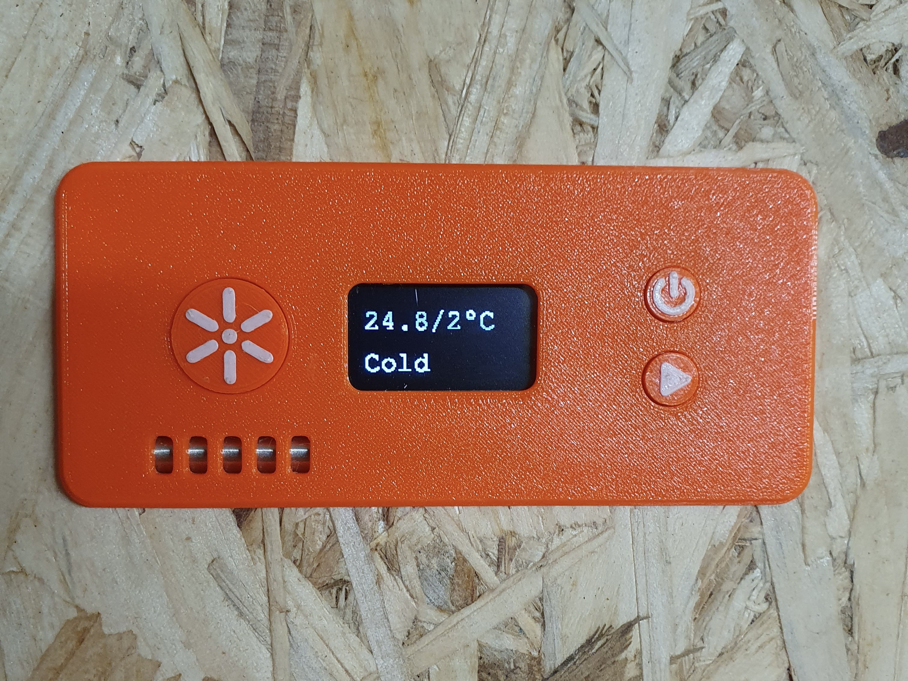


This project was a collaborative effort with my brother. We built a housing for our 3D printer that includes a Raspberry Pi Zero, three temperature sensors, a fan, a light, a webcam, buttons, and a small display. The Raspberry Pi runs my software, which manages the housing temperature and monitors print progress. The software also offers a simple API, which the [Flutter companion app]() connects to.


  

<!--  -->

## Temperature Control
With the companion app, users can create temperature profiles for specific filaments. Each profile includes a target temperature and a name. Using the app or the housing buttons, one can select a profile and initiate temperature control. The software adjusts the temperature inside the housing by considering the inside, outside, and target temperatures. To lower the temperature, the fan is activated; to raise it, the fan is turned off. An air filter is also included for the fan to prevent dust from entering the housing and to keep the outside air free of particles.

## Monitoring
When someone connects to the API, the software turns on the light, activates the webcam, and starts streaming the video feed. This enables users to monitor print progress from anywhere and ensure everything is proceeding smoothly. If a print fails, the user can quickly stop it using the Prusa Connect API.

## Control Panel

The control panel allows users to switch between temperature profiles, start and stop temperature control, and check the current temperature inside the housing. The large button on the left toggles the light on and off.

---
