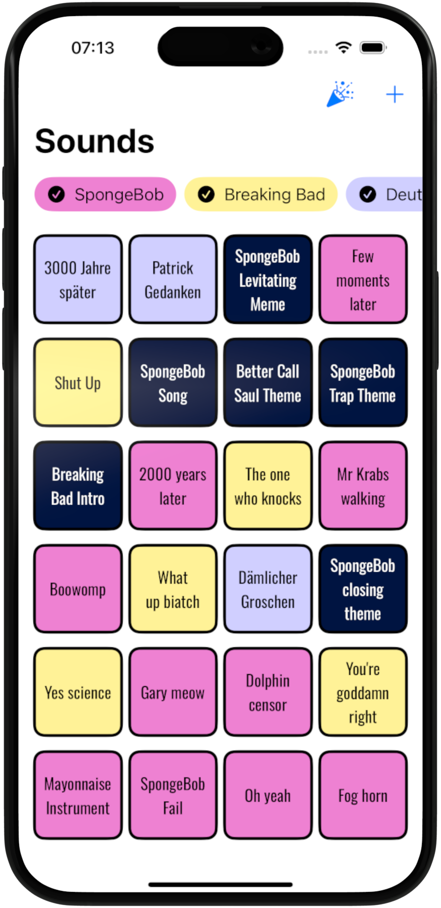
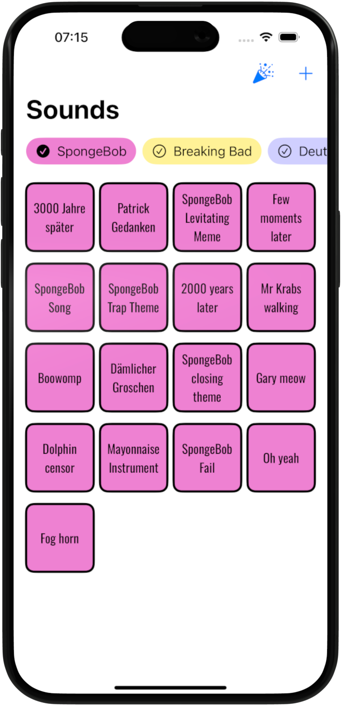
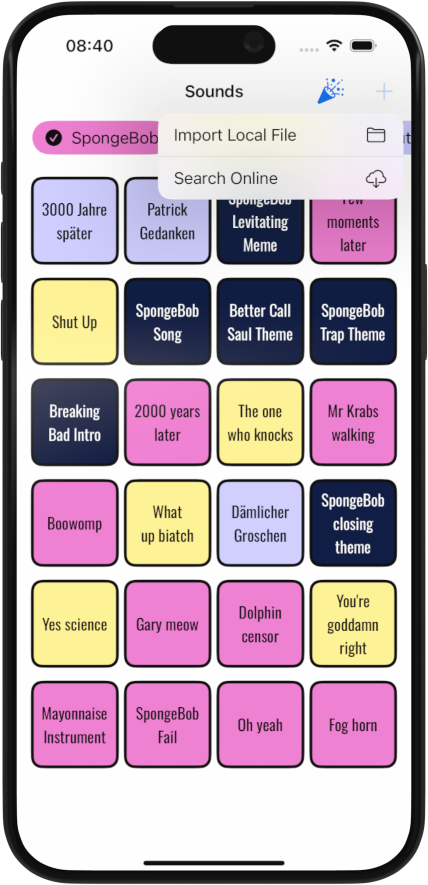
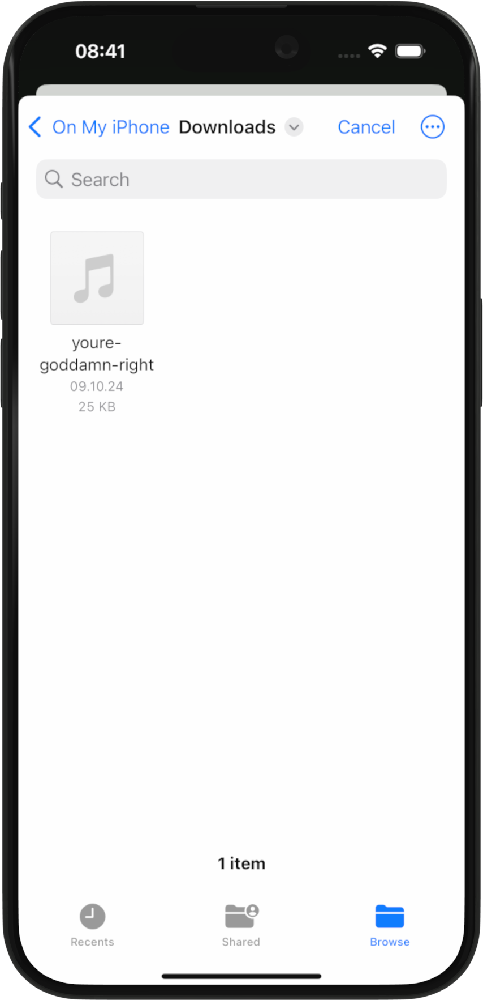
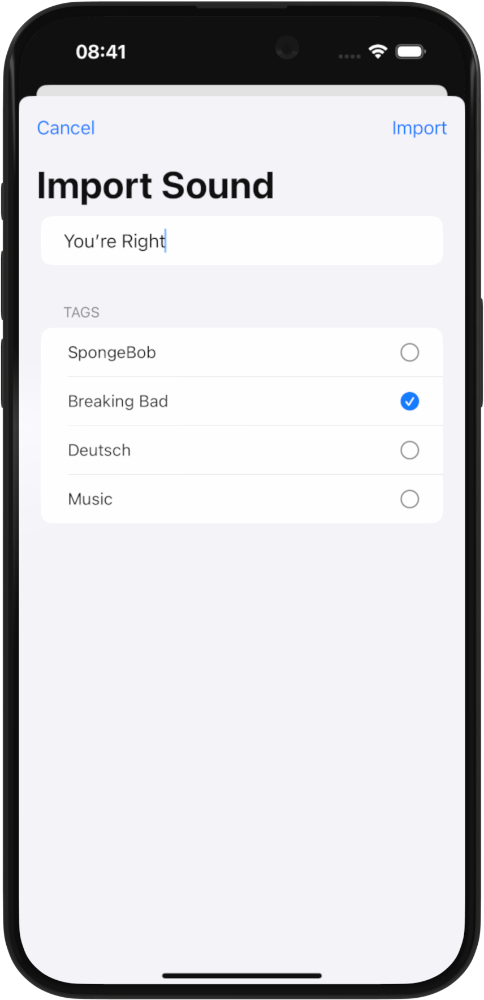


Before participating in the "iPratkikum", a course focusing on the developement of IOS apps for actual business clients offered by the technical university of Munich (TUM), we had to take an intro course to Swift and IOS app development. During this one week course, we were also supposed to create some simple app, in my case a soundboard app. The idea is simple: Are you bored? - Try the SoundBored.
 

  

## Main Screen
The main screen is just what you'd expect from a soundboard, an overview of sounds. Each sound is associated with one or mutliple tags, and each tag has a color and one or more icons. Clicking on the tags show at the top of the screen allows the used to filter the sounds. The color is just added for fun, but can also help getting a quick overview of the sounds of each category. 

  
  


## Importing new Sounds
What would a soundboard be without a way of adding new sounds? So I added the option to import local files as new sounds. And since we got each day some new requirements on the app, one of which was calling some API, I also added the option of importing online sounds. For this I used the Freesounds.org API to download and import a sound based on a search phrase. 

  
  
  

Shown above are the three steps of importing a new local sound. First you tap on the "+" button, then you select the file, and finally you enter the name of the sound and select the tags that should be associated with it.

## Sound Animations
One additional requirement was the use of an external package. The package that I choose is a confetti library, which simply displays some confetti on the screen. To make it blend in a little better with the app, I implemented it such that the confetti is made up of the icons of those tags that are associated with the currently playing sound. So when you tap on a sound that is associated both with SpongeBob and Music, then it rains little sponges and music notes.



---
