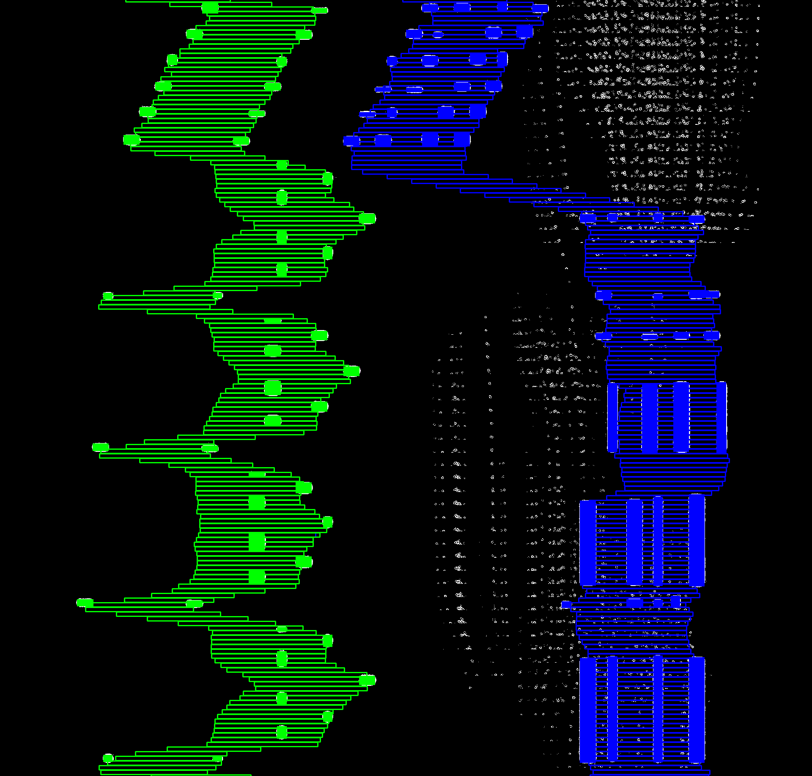


Converts Synthesia YouTube piano tutorials into MIDI files using classical computer vision techniques. While the tool works well, each video requires significant configuration. It can also integrate hand positions from imported hand poses to add fingering information to the MIDI files.


  

## Project Overview

On YouTube, many piano arrangements of popular songs are either created entirely with Synthesia or use a Synthesia-like visualization. Since sheet music is not always available or can be expensive, I developed a tool to convert these Synthesia videos into MIDI files. These MIDI files can then be used to create sheet music almost automatically. This project is intended for educational and personal use only, in order to avoid infringing on copyright laws.


Example of a synthesia piano video.

## Implementation Details
This project uses classical computer vision techniques to detect piano keys and notes. The pipeline consists of the following steps:

1. **Video Loading and Frame Extraction:** Load the video and extract frames.

2. **Distortion Removal:** Correct camera projection distortion to straighten curved keys. This step may require manual parameter tuning depending on the video.

3. **Frame Merging:** Merge frames into a single image by removing unnecessary parts such as hands, keyboard, and effects. Use vertical cross-correlation to estimate shifts between images, apply outlier rejection, and align accordingly.

4. **Image Preprocessing:** Preprocess the image for key detection. Several approaches were tested, e.g. different color spaces, filtering, and morphological operations. The best results were obtained by adjusting weighted color-channel combinations based on the keys’ predominant color.

5. **Key Splitting:** Split the image into thin vertical strips for accurate key detection. Since piano keys vary in width, splitting must be precise rather than uniform.

6. **Note Detection:** Detect notes by thresholding, extracting contours, and filtering by size and shape. Notes are then identified from these contours.

7. **Optional Hand Pose Integration:** If hand poses are available, map them to corresponding keys. Assign notes to the closest finger to enrich the MIDI file with hand/finger information, improving note separation between hands in notation software.

8. **MIDI Conversion:** Convert detected notes into MIDI by mapping positions to piano keys. Estimate note durations from contour lengths, considering tempo and time signature (set manually). Generate the MIDI file with the Java Sound API.

9. **MIDI Import:** Import the MIDI into notation software such as MuseScore for editing and printing. Manual adjustments may still be needed for complex pieces.

## Note Detection

This example shows the note detection process. Detected notes are highlighted - green for the left hand and blue for the right hand. The vertical lines mark hand positions. On the right side, visual noise appears due to special effects in the original video.

## Results and Future Work
The tool performs well but requires substantial manual configuration per video. It struggles with effects-heavy videos, changing key colors, or inconsistent tempos. To overcome these issues, I am currently exploring a deep learning approach to predict notes directly from audio rather than video. This method should require less configuration, generalize better, and be more practical, especially when the arrangement was created by ear and no original MIDI exists.

---
