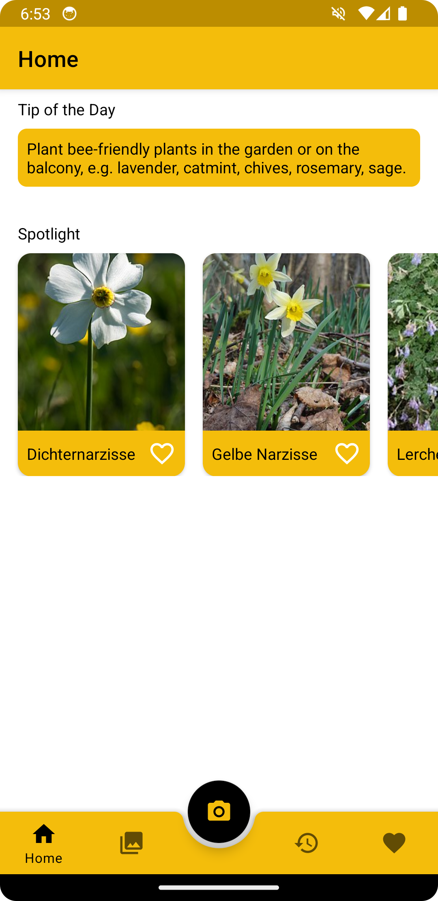


As part of a student project at the University of Applied Sciences Munich, we developed an Android app for the [We4Bee](https://we4bee.org/) project. We4Bee is a non-profit project aimed at revolutionizing the prediction of earthquakes and other natural disasters through the use of bees as bio-sensors. Our app complements this mission by encouraging users to create bee-friendly gardens, thereby supporting local bee populations.
 

## Overview


To begin the project, we designed a click-dummy in Figma to visualize the app's interface and functionality. We then developed the app using Android Studio.

## Homescreen


  
  


The homescreen displays a daily tip on how to support the local bee population. It also features a spotlight section highlighting plants that are optimal for bees, based on the current season and the user's location. Users can click on a plant to see more information, add it to their favorites, or view detailed descriptions on Wikipedia.

## Overview
  

  


The overview section provides a comprehensive list of plants that benefit bees throughout the year.

## Plant Identification


  
  
  


One of the main features of the app is the plant identification. You can take a picture of any plant and the app will try to identify it. For the identification, we used the PlantNet API. The app will then show you the result and fetch additional information about the plant using the Wikipedia API. Based on a lookup in an internal database you also get an indication of how bee-friendly the plant is.

## Favorites and History


  
  


The app also includes favorites and history sections. In the favorites section, users can save plants they want to add to their garden. The history section keeps track of all the plants users have scanned.

---
